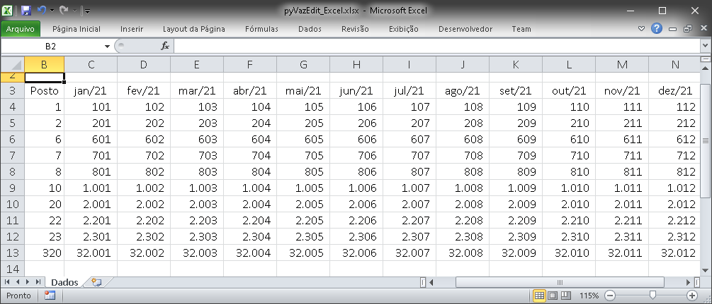

# pyVazEdit
Código em Python para ler e escrever arquivos binários de vazão utilizados nos modelos Newave, Decomp, Gevazp e Dessem.

Dados inseridos pelo pyVazEdit para o posto Camargos (ano 2021):

 

Modelo de arquivo Excel que o pyVazEdit lê para atualizar um arquivo de vazões binários:

 

## Utilização:

Em breve. Mas o arquivo 'pyVazEdit_Tests.py' pode lhe ajudar muito a como utilizar as funções do 'mapLoaders'

## Funções já implementadas:

### leVazoes:
Lê todas as vazões de um arquivo binário.

### salvaArquivo:
Salva os dados binários de vazão no arquivo especificado, utilizando um dos formatos válidos.

### mudaVazao:
Altera/inclui valores de/em um objeto 'historicoVazoes' para posterior uso/salvamento.

### lerVazoesExcel:
Lê valores de vazão de uma planilha Excel (xlsx) para atualizar um arquivo binário de vazões.

## Dependências:

Se desejar utilizar a função de leitura de dados de vazão do Excel: [openpyxl](https://openpyxl.readthedocs.io/en/stable/)

## Licença:

[Ver licença](LICENSE)

## Projeto relacionado:

[NVazEdit C#](http://nrbenergia.somee.com/SoftDev/NVazEdit/NVazEdit)

## Sobre o autor:

[Meu LinkedIn](http://www.linkedin.com/in/nelsonrossibittencourt)

[Minha página de projetos](http://www.nrbenergia.somee.com)

